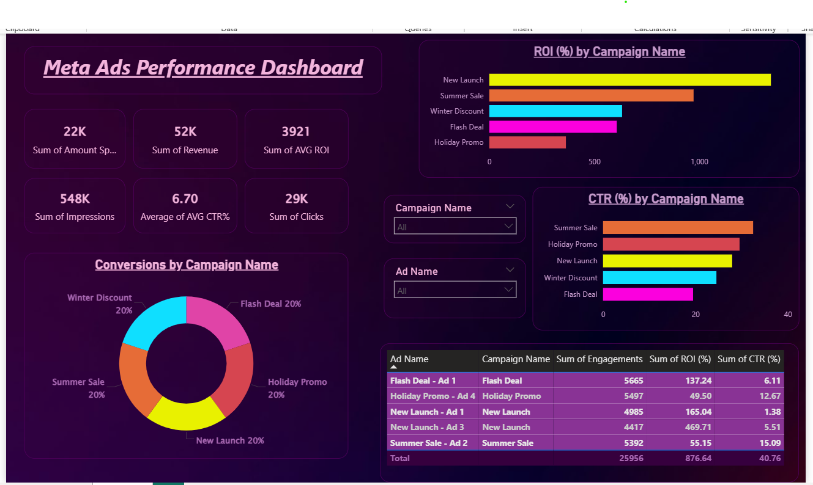

# 📊 Meta Ads Performance Dashboard

This project is an **interactive Power BI dashboard** designed to analyze the performance of Meta Ads campaigns.  
It provides key insights into **ROI, CTR, conversions, clicks, revenue, and impressions**, helping marketers make data-driven decisions.

---

## 🚀 Project Overview
The dashboard visualizes campaign performance metrics to track ad effectiveness and optimize strategies.  
It includes interactive filters, allowing users to explore specific campaigns and ad creatives.

---

## 📈 Features
- **ROI (%) by Campaign** – Compare return on investment across campaigns.
- **CTR (%) by Campaign** – Measure audience engagement through click-through rates.
- **Conversions Breakdown** – View the percentage of conversions for each campaign.
- **Key Metrics Overview**:
  - Amount Spent
  - Revenue Generated
  - ROI
  - Impressions
  - CTR
  - Clicks
- **Interactive Filters** for campaign and ad names.

---

## 🖼 Screenshot
*(You can add your dashboard screenshot here)*  
Example:

---

## 🛠 Tools & Technologies
- **Microsoft Power BI** – Data visualization and dashboard creation.
- **Meta Ads Data** – Marketing campaign dataset.
- **Data Analysis** – Power BI DAX & interactive visuals.

---

## 📂 File in Repository
- `AD Campaign.pbix` – The Power BI dashboard file containing all visuals and data.

---

## 📥 How to Use
1. Download the `.pbix` file from this repository.
2. Open it in **Microsoft Power BI Desktop**.
3. Explore the dashboard and interact with filters to view specific insights.

---

## 📌 Author
**Srikrishna Paul**  
*Data Analytics & Visualization Enthusiast*

---
